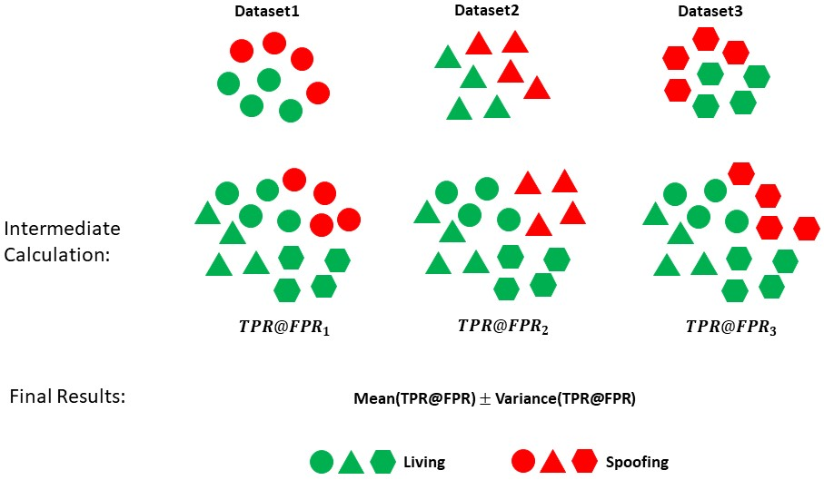

# Datasets

| Dataset    | Year | #Live/Spoof | #Sub. |  Setup | Attack Types |
| --------   | -----    | -----  |  -----  | ----- |------------------------|
| [CASIA-MFSD](http://www.cbsr.ia.ac.cn/users/jjyan/ZHANG-ICB2012.pdf)   | 2012 | 150/450(V) | 50 |  7 scenarios and 3 image quality | Print(flat, wrapped, cut), Replay(tablet)|
| [REPLAY-ATTACK](http://publications.idiap.ch/downloads/papers/2012/Chingovska_IEEEBIOSIG2012_2012.pdf)   | 2012 | 200/1000(V) | 50 |  Lighting and holding | Print(flat), Replay(tablet, phone) |
| [MSU-MFSD](http://biometrics.cse.msu.edu/Publications/Face/WenHanJain_FaceSpoofDetection_TIFS15.pdf)   | 2014 | 70/210(V) | 35 |  Indoor scenario; 2 types of cameras | Print(flat), Replay(tablet, phone) |
| [HKBU-MARs V2](https://link.springer.com/chapter/10.1007/978-3-319-46478-7_6)   | 2016 | 504/504(V) | 12 | 7 cameras from stationary and mobile devices and 6 lighting settings | Mask(hard resin) from Thatsmyface and REAL-f |
| [OULU-NPU](https://ieeexplore.ieee.org/document/7961798)   | 2017 | 720/2880(V) | 55 |  Lighting & background in 3 sections | Print(flat), Replay(phone) |
| [SiW](https://arxiv.org/abs/1803.11097)   | 2018 | 1320/3300(V) | 165 |  4 sessions with variations of distance, pose, illumination and expression | Print(flat, wrapped), Replay(phone, tablet, monitor)|
| [Rose-Youtu](https://ieeexplore.ieee.org/document/8279564)   | 2018 | 500/2850(V) | 20 | 5 front-facing phone camera; 5 different illumination conditions | Print(flat), Replay(monitor, laptop),Mask(paper, crop-paper)|
| [WFFD](https://arxiv.org/abs/2005.06514)   | 2019 | 2300/2300(I) 140/145(V) | 745 |  Collected online; super-realistic; removed low-quality faces | Waxworks(wax)|
| [CelebA-Spoof](https://link.springer.com/chapter/10.1007/978-3-030-58610-2_5)   | 2020 | 156384/469153(I) | 10177 |  4 illumination conditions; indoor & outdoor; rich annotations | Print(flat, wrapped), Replay(monitor tablet, phone), Mask(paper)|
| [CASIA-SURF](https://openaccess.thecvf.com/content_CVPR_2019/papers/Zhang_A_Dataset_and_Benchmark_for_Large-Scale_Multi-Modal_Face_Anti-Spoofing_CVPR_2019_paper.pdf)   | 2019 | 3000/18000(V) | 1000 |  VIS, Depth, NIR | Background removed; Randomly cut eyes, nose or mouth areas | Print(flat, wrapped, cut) |
| [WMCA](https://ieeexplore.ieee.org/document/8714076)   | 2019 | 347/1332(V) | 72 |  VIS, Depth, NIR, Thermal | 6 sessions with different backgrounds and illumination; pulse data for bonafide recordings | Print(flat), Replay(tablet), Partial(glasses), Mask(plastic, silicone, and paper, Mannequin) |
| [CeFA](https://openaccess.thecvf.com/content/WACV2021/html/Liu_CASIA-SURF_CeFA_A_Benchmark_for_Multi-Modal_Cross-Ethnicity_Face_Anti-Spoofing_WACV_2021_paper.html)   | 2020 | 6300/27900(V) | 1607 |  VIS, Depth, NIR | 3 ethnicities; outdoor & indoor; decoration with wig and glasses | Print(flat, wrapped), Replay, Mask(3D print, silica gel) |

# Protocol

## Protocol 1: Intra-Testing
All datasets are used as training and testing sets, simultaneously

## Protocol 2: Inter-Testing

### Protocol 2_1
**Training Sets**: MSU_MFSD, HKBU, OULU, CASIA_SURF, WMCA, CASIA_CeFA.

**Testing Sets**: CASIA_MFSD, Replay_attack, SiW, Rose_Youtu, WFFD, CelebA_Spoof.

### Protocol 2_1
**Training Sets**: CASIA_MFSD, Replay_attack, SiW, Rose_Youtu, WFFD, CelebA_Spoof.

**Testing Sets**: MSU_MFSD, HKBU, OULU, CASIA_SURF, WMCA, CASIA_CeFA.

# Evaluation Metrics
## Single-Side TPR@FPR
Due to the similar distribution of live faces, we gather all live data from each testing dataset as the negative cases, then partial spoof data in the current testing dataset is arranged as positive cases. Thus, we simulate a realistic data distribution that live faces account for the majority. Then, the values of the TPR@FPR are calculated in the different testing sets. Lastly, the mean and variance of them are used for an overall evaluation.

  

