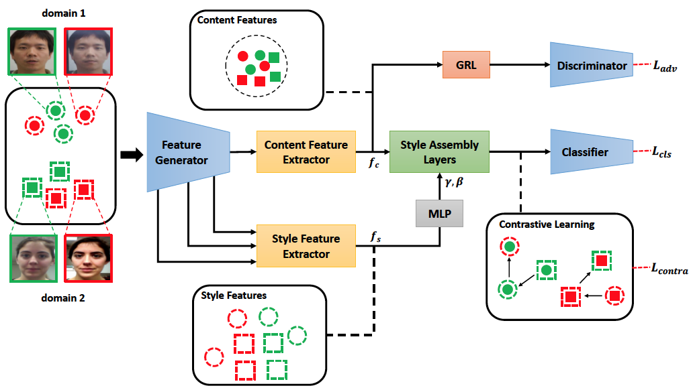

## Domain Generalization via Shuffled Style Assembly for Face Anti-Spoofing
This repository is the PyTorch implementation of the paper in CVPR 2022

<div align="center">
  
</div>

### [Paper](https://arxiv.org/abs/2203.05340)
> **Domain Generalization via Shuffled Style Assembly for Face Anti-Spoofing**<br>
>
> **Abstract** *With diverse presentation attacks emerging continually, generalizable face anti-spoofing (FAS) has drawn growing attention. Most existing methods implement domain generalization (DG) on the complete representations. However, different image statistics may have unique properties for the FAS tasks. In this work, we separate the complete representation into content and style ones. A novel Shuffled Style Assembly Network (SSAN) is proposed to extract and reassemble different content and style features for a stylized feature space. Then, to obtain a generalized representation, a contrastive learning strategy is developed to emphasize liveness-related style information while suppress the domain-specific one. Finally, the representations of the correct assemblies are used to distinguish between living and spoofing during the inferring. On the other hand, despite the decent performance, there still exists a gap between academia and industry, due to the difference in data quantity and distribution. Thus, a new large-scale benchmark for FAS is built up to further evaluate the performance of algorithms in reality. Both qualitative and quantitative results on existing and proposed benchmarks demonstrate the effectiveness of our methods.*
 
## Usage

### Prerequisites
- Linux or macOS
- CPU or NVIDIA GPU + CUDA CuDNN
- Python 3.x
- Pytorch 1.1.0 or higher, torchvision 0.3.0 or higher

### Data Placement
```
└── YOUR_Data_Dir
   ├── OULU_NPU
   ├── MSU_MFSD
   ├── CASIA_MFSD
   ├── REPLAY_ATTACK
   ├── SiW
   └── ...
```

### Implement
    python -u solver.py

## Protocol

### For OCIM
Four datasets are utilized to evaluate the effectiveness of our method in different cross-domain scenarios: [OULU-NPU](https://ieeexplore.ieee.org/document/7961798) (denoted as O), [CASIA-MFSD](http://www.cbsr.ia.ac.cn/users/jjyan/ZHANG-ICB2012.pdf) (denoted as C), [Replay-Attack](http://publications.idiap.ch/downloads/papers/2012/Chingovska_IEEEBIOSIG2012_2012.pdf) (denoted as I), [MSU-MFSD](http://biometrics.cse.msu.edu/Publications/Face/WenHanJain_FaceSpoofDetection_TIFS15.pdf) (denoted as M). 

We use a leave-one-out (LOO) strategy: three datasets are randomly selected for training, and the rest one for testing.

### For Large-Scale FAS Benchmarks
We used the benchmark settings [Large-Scale FAS Benchmarks](./Large_Scale_FAS_Benchmarks).

All face images are detected by [MTCNN](https://github.com/kpzhang93/MTCNN_face_detection_alignment), and then cropped.


## Citation
Please cite our paper if the code is helpful to your research.
```
@inproceedings{wang2022domain,
    author = {Wang, Zhuo and Wang, Zezheng and Yu, Zitong and Deng, Weihong and Li, Jiahong and Li, Size and Wang, Zhongyuan},
    title = {Domain Generalization via Shuffled Style Assembly for Face Anti-Spoofing},
    booktitle = {CVPR},
    year = {2022}
}
```